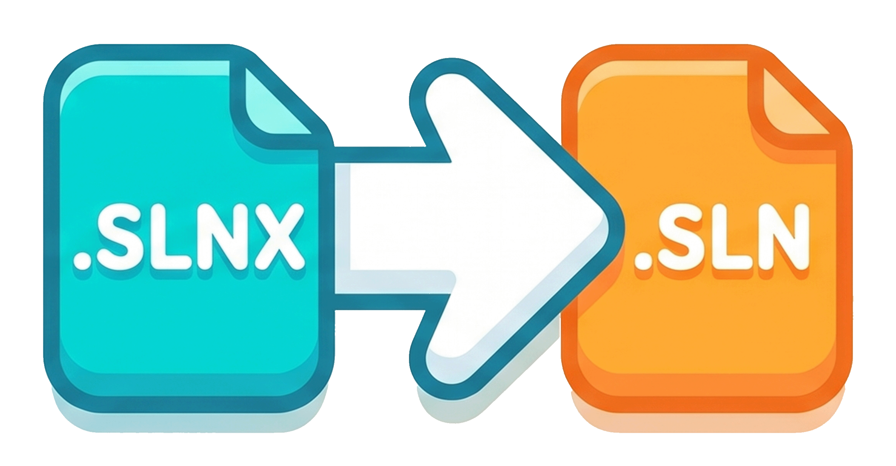

# SLNX auto-convert

<div align="center">
	
</div>

[English README](./README.md)

Unity / Visual Studio が生成する **`.slnx`** を、VS Code / Cursor 上で従来の **`.sln`** に変換する拡張機能です。変換は **拡張機能内の TypeScript** で行うため、マシンに **Python は不要**です。

コマンド名・設定説明・通知・ログなどはエディタの表示言語（**日本語** / **英語**）に合わせて切り替わります（`package.nls.*` と `l10n`）。

## ダウンロード

GitHub のリリースに添付されている **`slnx-auto-convert-0.1.0.vsix`** を利用してください。

- [Release v0.1.0](https://github.com/yshi112358/slnx-auto-convert/releases/tag/v0.1.0)

## インストール

1. VS Code または Cursor でコマンドパレットを開く。
2. **「Extensions: Install from VSIX…」**（拡張機能: VSIX からインストール…）を実行。
3. ダウンロードした `.vsix` を選択。

ソースからビルドする場合は末尾の [ソースからビルド](#ソースからビルド) を参照してください。

## 動作の概要

- ワークスペース内の **`.slnx`** の **作成・変更** を監視し、**同名のベース名**で **`.sln`** を生成します。
- 変換に成功したあと、元の **`.slnx` は削除**します（必要に応じてツールチェーンが再生成します）。
- 生成した **`.sln`** のワークスペース相対パスで **`dotnet.defaultSolution`** を更新します（**`ConfigurationTarget.Workspace`** — フォルダ単位のスコープはこの設定ではサポートされません）。
- Unity の **Visual Studio Editor** が **`dotnet.defaultSolution`** を **`.slnx`** に戻しがちな問題を抑えるため、拡張機能はデフォルトで、変換の前に **`.vscode/.vstupatchdisable`** が無ければ **自動作成**します（無効化するには設定 **`slnxAutoConvert.autoCreateVstuPatchDisable`** をオフにしてください）。

## 要件

- **VS Code** `^1.85.0` 以上（`engines.vscode` に準拠した互換環境）。
- **アクティベーション:** ワークスペースに少なくとも 1 つの **`*.csproj`** が含まれること（Unity の C# レイアウトが典型的です）。

## コマンド

| コマンド |
| -------- |
| **SLNX: ワークスペース内の .slnx を変換** |
| **SLNX: Unity の .vscode 自動パッチを無効化 (.vstupatchdisable)** |

## 設定（抜粋）

| キー | 説明 |
| ---- | ---- |
| `slnxAutoConvert.watchEnabled` | ファイル監視による自動変換のオン／オフ（既定: オン） |
| `slnxAutoConvert.debounceMs` | `.slnx` の create/change をまとめる待ち時間（ミリ秒） |
| `slnxAutoConvert.autoCreateVstuPatchDisable` | 変換前に `.vscode/.vstupatchdisable` が無ければ作成するか（既定: オン） |

## 注意・既知の挙動

- **マルチルートワークスペース:** **`dotnet.defaultSolution`** の相対パスはレイアウトによって調整が必要になることがあります。
- ソリューション切り替え直後、C# 言語サーバーが一時的に **CodeLens resolve** のバージョン不一致をログに出すことがあります。**Developer: Reload Window** で解消することが多いです。

## ソースからビルド

```bash
npm install
npm run compile
npx @vscode/vsce package --allow-missing-repository
```

## ライセンス

MIT（詳細は [LICENSE](./LICENSE)）。
